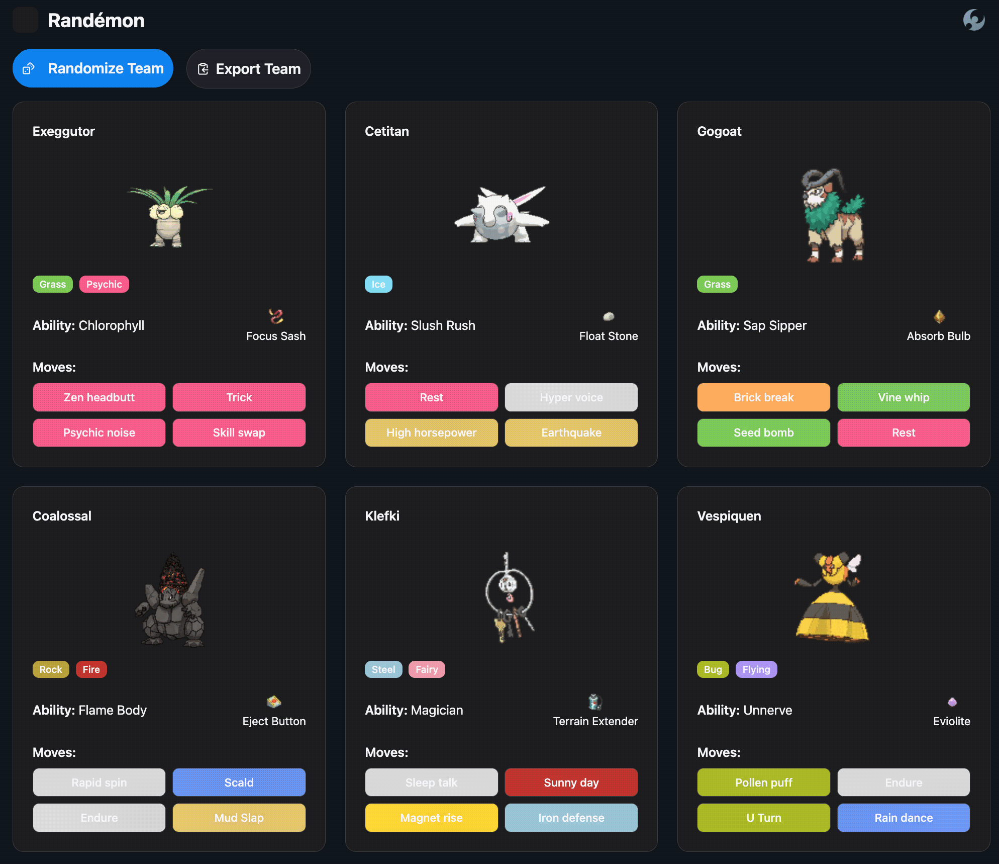

# Randémon

Randémon generates six-member Pokémon teams from the Generation 9 Pokédex. Each team includes randomized abilities, held items, and moves, with a copy-ready export for Pokémon Showdown.

[Try the deployed application](https://randemon.vercel.app/)



## Features

- Generates a new six-member team
- Selects four moves per Pokémon without replacement
- Prevents duplicate abilities and held items within a team
- Exports the complete team in Pokémon Showdown text format
- Supports light and dark themes
- Recovers from upstream failures with an in-app retry action
- Validates imported and fetched data before it reaches the UI

## Tech stack

- Next.js 16 App Router and React 19
- TypeScript with strict type checking
- Tailwind CSS 4 and Radix UI
- Vitest and Testing Library
- GitHub Actions, Dependabot, and Vercel
- [PokéAPI](https://pokeapi.co/) for Pokémon and held-item data

## Running locally

### Prerequisites

- Node.js 22.13.0
- npm

### Setup

```bash
git clone https://github.com/Aethos808/rand-mon.git
cd rand-mon
npm ci
npm run dev
```

Open [http://localhost:3000](http://localhost:3000).

No environment variables or external services are required. The application requests public data from PokéAPI at runtime.

## Available commands

```bash
npm run dev          # Start the development server
npm run test         # Run the test suite once
npm run test:watch   # Run tests in watch mode
npm run lint         # Run ESLint
npm run typecheck    # Check TypeScript types
npm run format-check # Check formatting
npm run build        # Create a production build
npm run start        # Run the production build
```

## Architecture

The home route is a React Server Component. It calls the team service during rendering, so team assembly and PokéAPI access remain on the server. Regeneration uses an App Router refresh to request a newly rendered team without maintaining a parallel client-side data layer.

The team service coordinates Pokémon, move, ability, and item selection. Random and service dependencies can be injected for deterministic tests. Retry limits and sampling without replacement keep every randomization path bounded.

Data is validated where it enters the application. PokeAPI requests have timeouts, contextual errors, and minimum response validation; bundled Pokédex and move records are parsed before use. Client components are limited to interactions such as theme selection, route refresh, dialog state, and clipboard access.

## Engineering decisions

- **Server-rendered generation:** centralizes orchestration and keeps upstream data access out of the browser, at the cost of requiring a server round trip to regenerate.
- **Small runtime validators:** protect the fields the application consumes without adding a schema-library dependency.
- **Bounded randomness:** retry limits and deterministic sampling prevent malformed or constrained data from causing non-terminating requests.
- **Explicit cache policy:** Pokémon requests use fresh data, while effectively immutable held-item details may be shared by the Next.js cache.
- **Behavior-focused tests:** injectable dependencies make random and failure paths reproducible without network requests.

These choices make the repository a focused code sample for server/client boundaries, external-data validation, reliable asynchronous workflows, and deterministic testing.

## Known limitations

- Generated teams are intentionally random and are not guaranteed to be competitive or legal in every format.
- The Showdown export uses fixed EV and nature values and targets Generation 9 Anything Goes.
- Teams cannot currently be reproduced from a seed, saved, or shared by URL.
- Team generation depends on PokéAPI availability.
- The application supports Generation 9 Pokémon only.

## Quality checks

Every push to `main` and every pull request runs a clean install, high-severity dependency audit, formatting check, lint, typecheck, test suite, and production build in GitHub Actions. Dependabot also checks monthly for version updates and groups non-major development dependency updates.

## Attribution

Pokémon and held-item data is provided by [PokéAPI](https://pokeapi.co/). Animated Pokémon sprites are sourced through PokéAPI from the [Pokémon Showdown](https://pokemonshowdown.com/) sprite collection.

Pokémon and Pokémon character names are trademarks of Nintendo, Game Freak, and The Pokémon Company. This is an unofficial, non-commercial fan project and is not affiliated with or endorsed by those companies.

## AI-assisted development

AI coding assistants supported planning, refactoring, test drafting, and documentation. I defined the requirements, selected the implementation approach, reviewed the generated changes, ran the validation suite, and take responsibility for the final code and its behavior.
